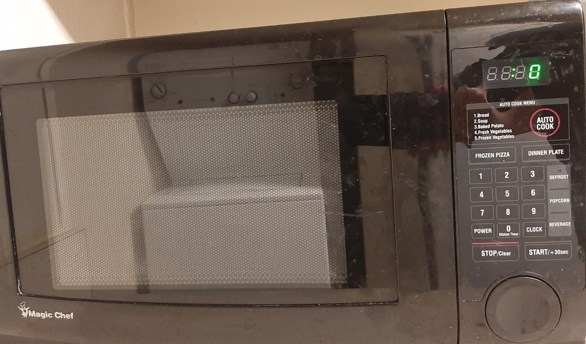
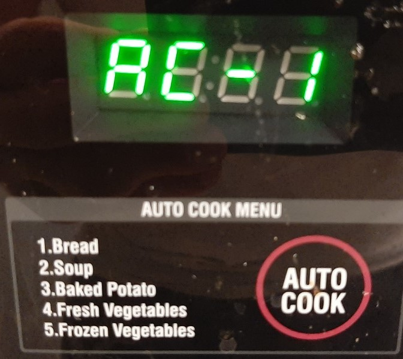
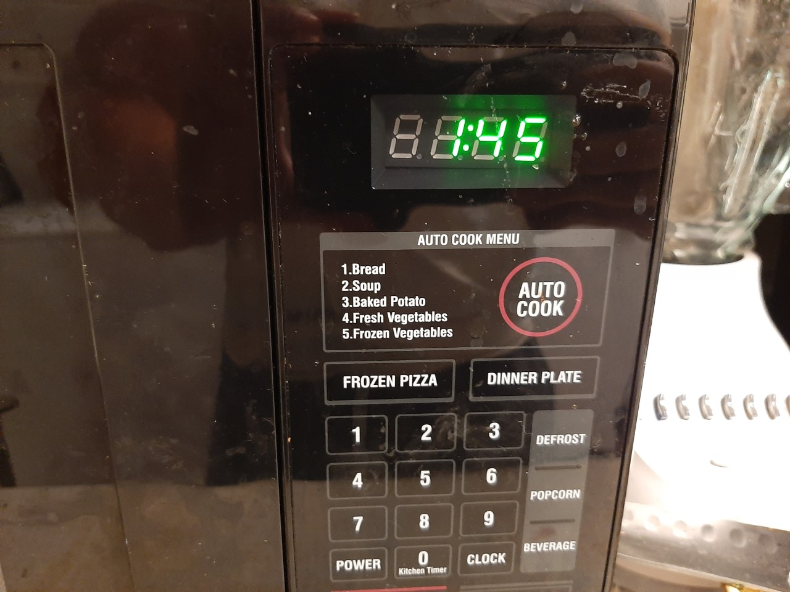
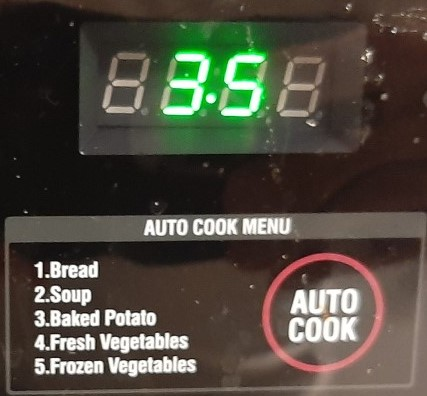
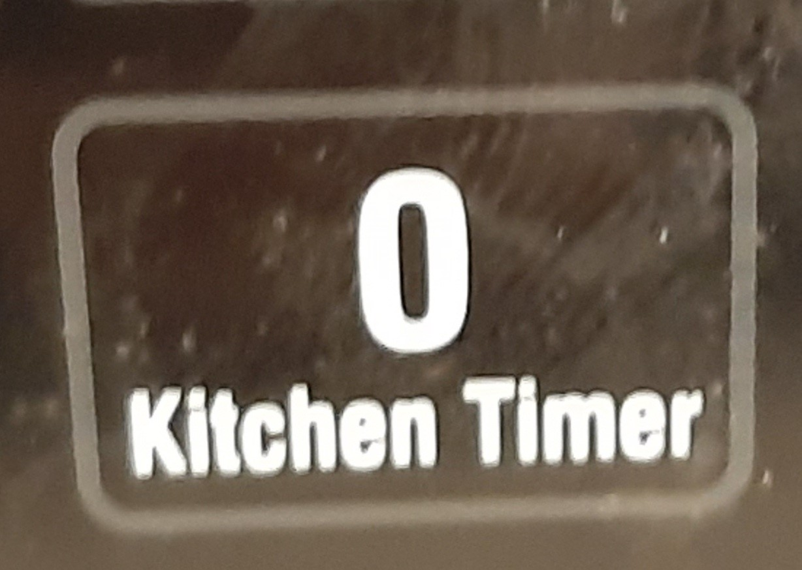
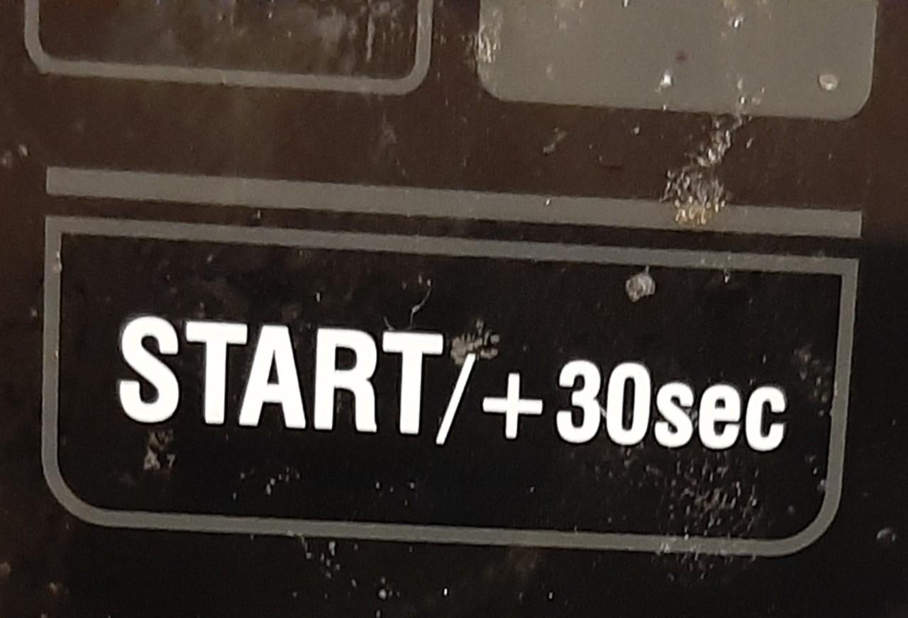
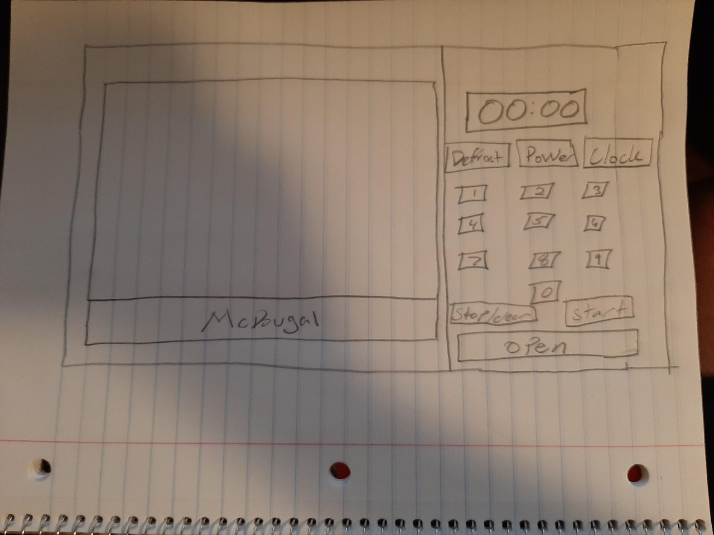
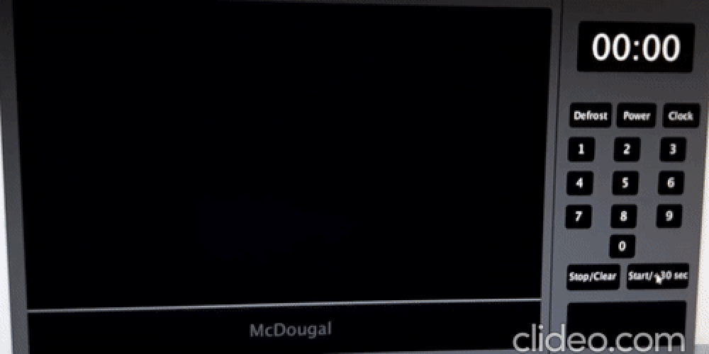
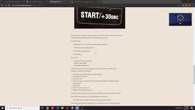

# Project-1-HCI

Some of the Issues with the design of the microwave and its functionality:

* If you push the Auto run but you get 5 food options that come with set times. But it not super clear.

* If you push the popcorn or defrost it give you a decimal 0.0. But its not clear at all that this means.

* There is a frozen pizza and dinner plate opton.
* The kitchen timer is also the 0 button would be nice to have 2 separate buttons.

* The start and the +30 seconds are on the same button. 

-----------------------------------------------------------------------------------------------------------------------------------------------------------------------------------

List your most common uses and other more rare uses of a microwave. Does the interface make doing those common things easier?

Common uses:
* Microwave ovens used for reheating and cooking

* Food processing applications

* Pre-heating applications

* Pre-cooking

Rare Uses: 
* Wireless Communications
* Military and Radar
* Research Applications

Think about how the user interacts with the microwave. What is the common sequence of actions?

1. Push the big round button to open the door
2. Put food on the glass 
3. Close the door
4. Type how long you want the food to be heated for by pushing on the numberpad
5. Push start
6. Wait for time to hit 0:00 
7. Open door and take food out 

How does the microwave support the user figure out how to make it work?

How does the microwave provide feedback to the user?
* By turning on a light and showing a timer on the screen.

What are some common mistakes you can make with this current design?
* Under cooking 
* Over cooking 

Suggest the improvements to make on the control interface. Sketch your solution and justify your design decisions.

Here is an example of Low-Fidelity Prototype sketching out the design (for a different purpose).

# My Microwave

