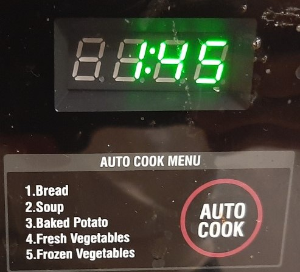

# Project-1-HCI

Some of the Issues with the design of the microwave and its functionality:

* If you push the Auto run but you get 5 food options that come with set times. But it not super clear.

* If you push the popcorn or defrost it give you a decimal 0.0. But its not clear at all that this means.

* There is a frozen pizza and dinner plate opton.
* The kitchen timer is also the 0 button would be nice to have 2 separate buttons.

* The start and the +30 seconds are on the same button. 

-----------------------------------------------------------------------------------------------------------------------------------------------------------------------------------

* List your most common uses and other more rare uses of a microwave. Does the interface make doing those common things easier?

Common uses:
* To heat up food
* Timer

Rare Uses: 

* Think about how the user interacts with the microwave. What is the common sequence of actions?

* How does the microwave support the user figure out how to make it work?

* How does the microwave provide feedback to the user?

* What are some common mistakes you can make with this current design?

* Suggest the improvements to make on the control interface. Sketch your solution and justify your design decisions.

* Here is an example of Low-Fidelity Prototype sketching out the design (for a different purpose).
